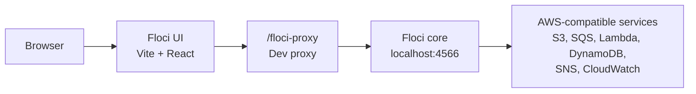

# Floci UI

Floci UI is a local web console for [Floci](https://github.com/floci-io/floci), the free local AWS emulator.

It is designed to feel familiar to AWS Console users while staying honest about the current implementation: the UI only renders real data returned by Floci-compatible APIs. If a service or operation is not wired yet, the screen stays empty or shows an explicit placeholder. No fake resources, demo rows, or mock service data are shown in normal mode.

## Why Floci UI?

Floci exposes AWS-compatible APIs on `http://localhost:4566`. That is ideal for SDKs, CLI scripts, and automated tests, but day-to-day local development also needs a visual layer:

- See which Floci server the UI is connected to.
- Browse real local AWS resources without leaving the browser.
- Inspect service state without inventing resources.
- Use CloudWatch logs and metrics as the telemetry surface.
- Keep unsupported screens explicit instead of hiding gaps behind dummy data.

## Relationship to Floci Core

Floci core is the emulator. Floci UI is only the console layer.



The UI does not create custom backend endpoints. It talks to Floci using AWS-compatible protocols:

| Protocol | Used by |
|---|---|
| REST XML | S3 |
| AWS Query | SQS, SNS |
| AWS JSON 1.0 | DynamoDB, CloudWatch Metrics |
| AWS JSON 1.1 | CloudWatch Logs |
| REST JSON | Lambda |

## Current UI Status

These percentages describe UI coverage for the connected Floci service, not backend completeness. Floci core supports more operations than this UI currently exposes.

| Service | UI coverage | Current UI status |
|---|---:|---|
| S3 | 75% | Dedicated browser with bucket list, object navigation, upload, download, object delete, bulk object delete, object copy, object metadata, object tags, bucket tags, bucket versioning, create bucket, delete bucket. |
| DynamoDB | 50% | Dedicated table browser with table list, metadata, scan mode, item table rendering, and configurable scan limit. |
| SQS | 40% | Dedicated queue browser with queue list, attributes, message counts, send message, and non-destructive message peek. |
| Lambda | 30% | Dedicated function grid with search, runtime badges, state badges, handler, memory, timeout, code size, and last modified metadata. |
| CloudWatch | 60% | Dedicated page for log groups, log streams, log events, metrics, alarms, live refresh, and Floci request-ingestor log parsing. |
| SNS | 5% | Generic resource list only. It lists topics but does not yet expose topic actions or a dedicated SNS workflow. |

Connected services today:

- CloudWatch
- S3
- SQS
- Lambda
- DynamoDB
- SNS

Placeholder services today:

- Secrets Manager
- Cognito
- RDS
- ElastiCache
- IAM
- Systems Manager
- KMS

## Service Detail

### S3 - 75%

Implemented:

- List buckets.
- Create bucket.
- Delete bucket.
- Browse objects by prefix.
- Folder-style navigation and breadcrumb.
- Create folder placeholders.
- Upload objects.
- Download objects.
- Delete one object.
- Delete multiple selected objects.
- Copy objects.
- Read object metadata.
- Read and update object tags.
- Read and update bucket tags.
- Read and update bucket versioning.

Missing:

| Feature | Floci API availability |
|---|---|
| Bucket policy management | Available in core if S3 policy endpoints are enabled |
| Object version browser | Versioning exists, UI does not list object versions yet |
| Presigned URL workflow | Available through AWS-compatible S3 behavior |
| Multipart upload UI | Available in core, not exposed in UI |

### DynamoDB - 50%

Implemented:

- List tables.
- Describe table metadata.
- Show status, item count, size, and billing mode.
- Scan table items.
- Choose scan limit.
- Render returned items dynamically from real attributes.

Missing:

| Feature | Floci API availability |
|---|---|
| Create table | `CreateTable` |
| Delete table | `DeleteTable` |
| Put item with JSON editor | `PutItem` |
| Edit item | `PutItem` / `UpdateItem` |
| Delete item | `DeleteItem` |
| Query by partition key | `Query` |
| TTL view and update | `DescribeTimeToLive` / `UpdateTimeToLive` |
| Batch write and bulk delete | `BatchWriteItem` |

### SQS - 40%

Implemented:

- List queues.
- Select queue.
- Read queue attributes.
- Show message counts.
- Show configuration such as visibility timeout, retention, max message size, FIFO, and receive wait.
- Send message.
- Peek messages without consuming them.

Missing:

| Feature | Floci API availability |
|---|---|
| Create queue | `CreateQueue` |
| Delete queue | `DeleteQueue` |
| Purge queue | `PurgeQueue` |
| Delete selected message after receive | `DeleteMessage` |
| Send batch | `SendMessageBatch` |
| Receive and delete workflow | `ReceiveMessage` + `DeleteMessage` |
| Queue tags | `ListQueueTags` / `TagQueue` / `UntagQueue` |
| Dead-letter queue configuration UI | `GetQueueAttributes` / `SetQueueAttributes` |

### Lambda - 30%

Implemented:

- List functions.
- Search functions by name or runtime.
- Show runtime badges.
- Show state badges.
- Show handler, memory, timeout, code size, and last modified.

Missing:

| Feature | Floci API availability |
|---|---|
| Function detail panel | `GetFunctionConfiguration` |
| Invoke function with JSON payload | `Invoke` |
| View and edit environment variables | `UpdateFunctionConfiguration` |
| Event source mappings | `ListEventSourceMappings` |
| Aliases | `ListAliases` |
| Versions | `ListVersionsByFunction` |
| Link to CloudWatch logs | CloudWatch log groups |
| Create function | `CreateFunction` |
| Delete function | `DeleteFunction` |

### CloudWatch - 60%

Implemented:

- List log groups.
- Filter log groups by prefix.
- List streams for a selected group.
- List events for a selected stream.
- Search event messages.
- Parse Floci request-ingestor JSON events into readable rows.
- List metrics.
- List alarms.
- Auto-refresh logs and events.

Missing:

| Feature | Floci API availability |
|---|---|
| Create log group from UI | `CreateLogGroup` |
| Create log stream from UI | `CreateLogStream` |
| Put manual log events from UI | `PutLogEvents` |
| Delete log group/stream | `DeleteLogGroup` / `DeleteLogStream` |
| Metric graphing | `GetMetricStatistics` / `GetMetricData` |
| Alarm creation and edit | `PutMetricAlarm` |

### SNS - 5%

Implemented:

- List topics through the generic service resource view.

Missing:

| Feature | Floci API availability |
|---|---|
| Dedicated SNS page | UI work needed |
| Create topic | `CreateTopic` |
| Delete topic | `DeleteTopic` |
| Publish message | `Publish` |
| Topic attributes | `GetTopicAttributes` |
| List subscriptions by topic | `ListSubscriptionsByTopic` |
| Subscribe endpoint | `Subscribe` |
| Unsubscribe endpoint | `Unsubscribe` |
| Topic tags | `TagResource` / `ListTagsForResource` |

## Priority Roadmap

Recommended order by impact and implementation effort:

| Priority | Service | Why |
|---:|---|---|
| 1 | S3 | Already close to complete; finish bucket/object management first. |
| 2 | DynamoDB | Item CRUD and query mode make the table browser useful for real development. |
| 3 | CloudWatch | Metric graphing, alarm management, and log-group actions improve debugging for every connected service. |
| 4 | SQS | Queue lifecycle, purge, tags, and receive/delete complete the common workflow. |
| 5 | Lambda | Detail panel and invoke flow unlock active debugging. |
| 6 | SNS | Needs a dedicated page and topic/subscription workflows from scratch. |

## Setup

Install dependencies:

```bash
npm install
```

Create local environment:

```bash
cp .env.example .env
```

Start Floci core:

```bash
cd ../floci
./mvnw clean quarkus:dev
```

Start Floci UI:

```bash
cd ../floci-ui
npm run dev
```

Open:

```text
http://127.0.0.1:3000/
```

## Environment

```bash
VITE_FLOCI_BASE_URL=http://localhost:4566
VITE_MOCK_MODE=false
```

`VITE_MOCK_MODE=true` is only for UI smoke testing. In mock mode, the UI returns empty states instead of fake service resources.

## Verification

```bash
npm run lint
npm run type-check
npm run build
```

## Design Direction

The target experience is a practical AWS-console-style interface:

- Dense, service-oriented navigation.
- Clear connection state in the top bar.
- Real resource counts.
- Dedicated pages for high-usage services.
- Empty states when no resources exist.
- Placeholders when a service is not wired yet.
- No decorative data or fake operational metrics.

## Contributing

When adding service UI, follow these rules:

- Use existing Floci AWS-compatible endpoints.
- Do not add custom backend endpoints just for the UI unless the core project explicitly accepts that contract.
- Prefer real empty states over sample data.
- Keep service status percentages updated in this README.
- Add verification notes for any newly wired operations.

## License

This project follows the Floci ecosystem license.
